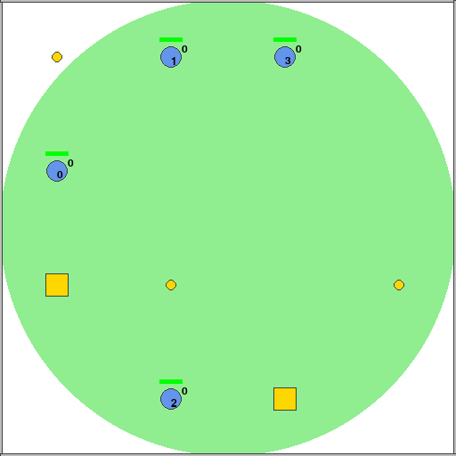

# Gym interface for a 2D MARL survival environment

A Multi-Agent Reinforcement Learning survival environment in 2D with a OpenAI 
Gym interface. This is not a proper Python package yet; source code is in the 
`masurvival` directory.

## Environment description

TODO

### Specifications

TODO

## Dependencies

- Box2D for physics

- Numpy for other math

- PyGame for rendering

